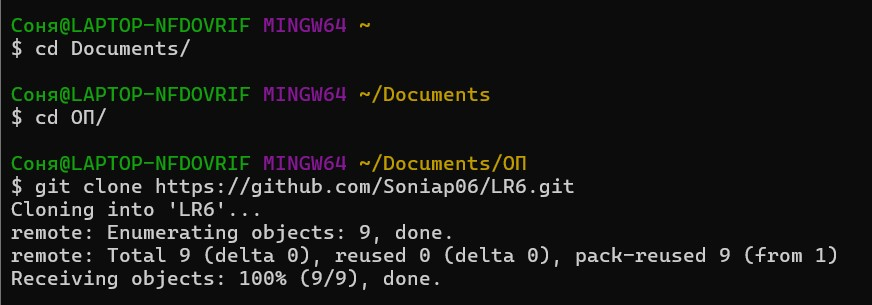
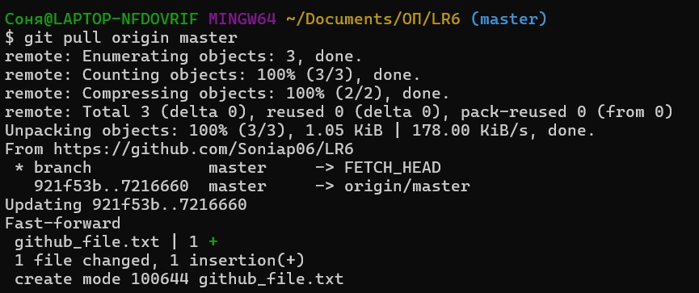
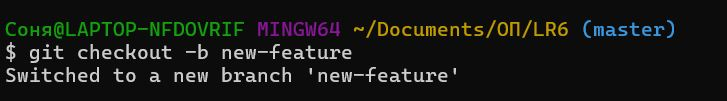
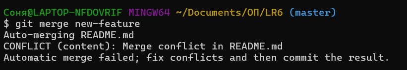
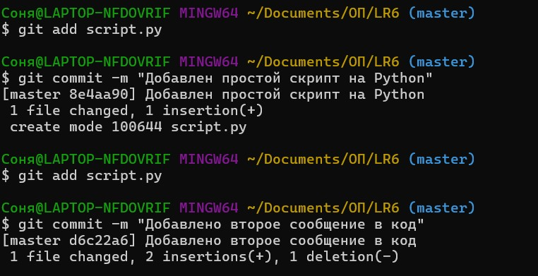
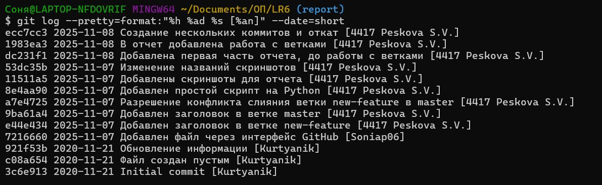

# Лабораторная работа №6
## Система контроля версий 

Цель лабораторной работы: изучение базовых возможностей системы
управления версиями, опыт работы с Git Api, опыт работы с локальным и
удаленным репозиторием. 

## Ход работы

1. Настройка клиент git

  
   
  <em>Рисунок 1: Настройка глобальных параметров Git</em>

2. Клонирование репозитория
Личный удалённый репозиторий был клонирован на локальный компьютер.

  
   
  <em>Рисунок 2: Процесс клонирования репозитория</em>

3. Добавление файла через интерфейс GitHub. 
Файл был добавлен через веб-интерфейс GitHub, после чего изменения были подтянуты в локальный репозиторий.

  
   
  <em>Рисунок 3: Добавление файла через веб-интерфейс</em>

4. Работа с историей операций
Была просмотрена история операций для каждой из веток и последние изменения.

  
   
  <em>Рисунок 4: Просмотр истории коммитов</em>

  
   
  <em>Рисунок 5: Просмотр истории оследних изменений</em>

5. Создание ветки и работа с конфликтами
Создание новой ветки:

  
   
  <em>Рисунок 6: Создание новой ветки new-feature</em>

Внесение изменений и коммит в новой ветке:

  
   
  <em>Рисунок 7: Изменения в новой ветке</em>

Возврат в master и создание конфликтующих изменений:

  
   
  <em>Рисунок 8: Создание конфликта</em>

Слияние веток:

  
   
  <em>Рисунок 9: Обнаружение конфликта при слиянии</em>

Разрешение конфликта путем изменения файла README.md:

  
   
  <em>Рисунок 10: Фиксация разрешенного конфликта</em>

Удаление побочной ветки:

  
   
  <em>Рисунок 11: Удаление, созданной ветки</em>

6. Создание нескольких коммитов и откат

Создание файла и коммитов:

  
   
  <em>Рисунок 12: Два новых коммита</em>

Откат коммита:

  
   
  <em>Рисунок 13: Откат последнего коммита</em>

7. Создание ветки для отчёта и оформление

Создание ветки:

  
   
  <em>Рисунок 14: Создание новой ветки для отчета</em>

8. История операций в форматированном виде

  
   
  <em>Рисунок 15: История коммитов в форматированном виде</em>

## Лог команд
- git clone
- git pull
- git add
- git commit -m
- git push
- git show
- git branch
- git checkout
- git log
- git merge
- git branch -d
- git revert HEAD
- git push --set-upstream origin
- git log --pretty=format:"%h - %an, %ar : %s"

## Вывод
В ходе лабораторной работы были изучены базовые операции Git: клонирование, коммит, работа с ветками, слияние с разрешением конфликтов, откат изменений. Получен навык работы с удаленным репозиторием на GitHub.